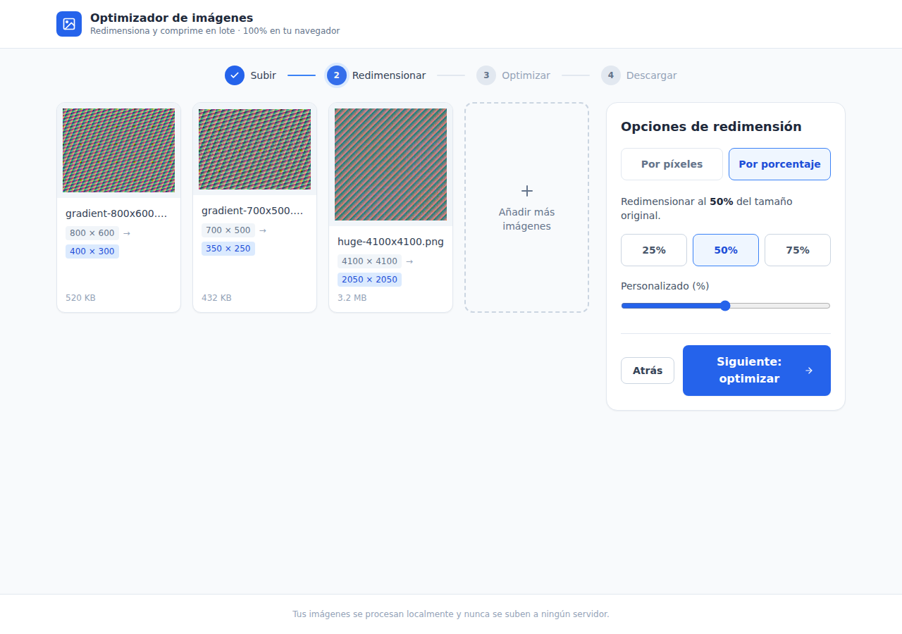
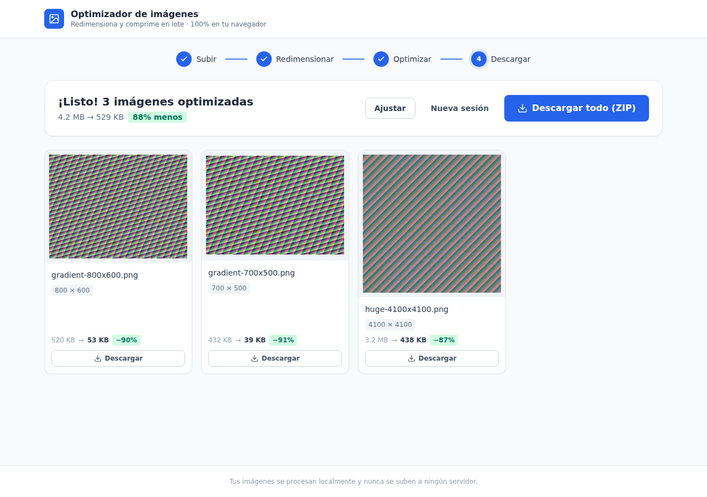

# Optimizador de imágenes en lote

Herramienta web para **redimensionar y optimizar imágenes en lote**, al estilo de
iloveimg, pero con una diferencia clave: **todo el procesamiento ocurre en tu
navegador**. Las imágenes nunca se suben a ningún servidor — es gratis, privado y
funciona sin conexión.

Flujo en 4 pasos: **Subir → Redimensionar → Optimizar para web → Descargar**
(individual o en ZIP).




## Características

- 📦 **Lote**: arrastra y suelta varias imágenes a la vez.
- 📐 **Redimensionar** por píxeles (ancho/alto, mantener proporción, no agrandar) o
  por porcentaje (25 / 50 / 75 % o personalizado).
- 🗜️ **Optimizar para web**: salida en **WebP** (recomendado), **JPG** (MozJPEG),
  **PNG** o "mantener original", con control de calidad. Muestra el % de ahorro.
- 🔒 **100% local**: no hay backend. Se despliega como sitio estático.
- ⚡ **Rápido**: procesamiento en Web Workers (varias imágenes en paralelo) para no
  congelar la interfaz.

## Cómo funciona

- **Decodificación** con `createImageBitmap` (respeta la orientación EXIF; reduce en
  el decode las imágenes enormes para esquivar el tope de área de canvas de iOS).
- **Redimensión** de alta calidad (Lanczos) con [`@jsquash/resize`](https://github.com/jamsinclair/jSquash).
- **Codificación** con `@jsquash/webp` y `@jsquash/jpeg` (motor de Squoosh). Se usa
  jSquash en vez de `canvas.toBlob` porque Safari no codifica WebP por canvas.
- **Una sola codificación por imagen**: el paso de redimensión solo calcula
  dimensiones (matemática pura); la codificación ocurre una vez, desde el original,
  al procesar. Sin pérdida por recompresión.
- **Concurrencia** acotada (`min(núcleos, 4)`) con un pool de workers vía `comlink`.
- **ZIP** en streaming y bajo consumo de memoria con `client-zip`.

Todos los códecs usados son de un solo hilo, así que **no hacen falta cabeceras
COOP/COEP** ni cross-origin isolation: la app corre en cualquier host estático.

## Desarrollo local

```bash
npm install
npm run dev            # http://localhost:5173
```

## Build y despliegue online

```bash
npm run build          # genera dist/ (estático)
npm run preview        # previsualiza el build en local
```

`dist/` es un sitio estático: súbelo tal cual a **Vercel, Netlify, Cloudflare Pages
o GitHub Pages**. No requiere servidor ni configuración especial.

> **GitHub Pages (sitio de proyecto):** sirve bajo `/<repo>/`. Ajusta `base` en
> `vite.config.ts` a `'/optimizador-imagenes-saas/'` antes de construir. Vercel /
> Netlify / Cloudflare usan la raíz `'/'` (valor por defecto).

## Pruebas

```bash
npm test               # unitarias (Vitest): lógica de resize, nombres, ahorro…
npm run e2e            # end-to-end (Playwright): build + fixtures + flujo real en Chromium
```

Los tests e2e corren contra el **build de producción** servido sin cabeceras
especiales, verificando el flujo completo (subir → redimensionar → WebP → descargar
individual y ZIP), incluida una imagen de >16 MP.

## Estructura

```
src/
├── components/     # UI: Dropzone, ImageGrid, Stepper, paneles Resize/Optimize/Download
├── lib/            # resizeMath (lógica pura), decode, pipeline, pool de workers, zip
├── workers/        # pipeline.worker.ts: resize + encode (jSquash) fuera del hilo principal
├── store/          # estado global (Zustand)
└── types.ts
```

## Fuera de alcance (posible futuro)

Cuentas / pagos (SaaS), decodificación real de HEIC, AVIF como salida, recorte y
marca de agua, PWA para uso offline total.
